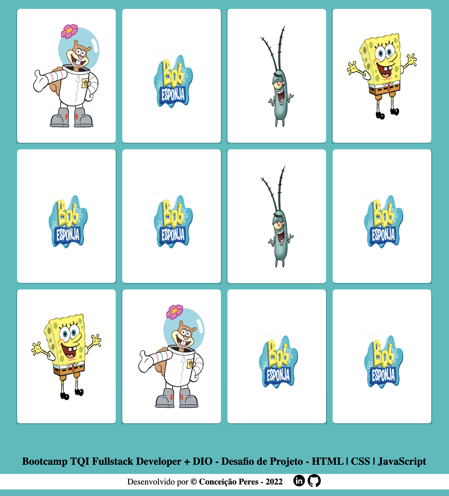

# Desafio de Projeto para conclusão de módulo.
**Bootcamp TQI Fullstack Developer - DIO**.  
### Objetivo
Criar um jogo da memória utilizando apenas HTML, CSS e Javascript.  Trabalhar com efeitos 3D no CSS e lógica de programação utilizando condicionais, Immediately Invoked Function Expression e manipulação de Array.  
<a href="https://conceicao-peres.github.io/jogo-da-memoria/" target="_blank"> _**DEMO**_ </a> 
